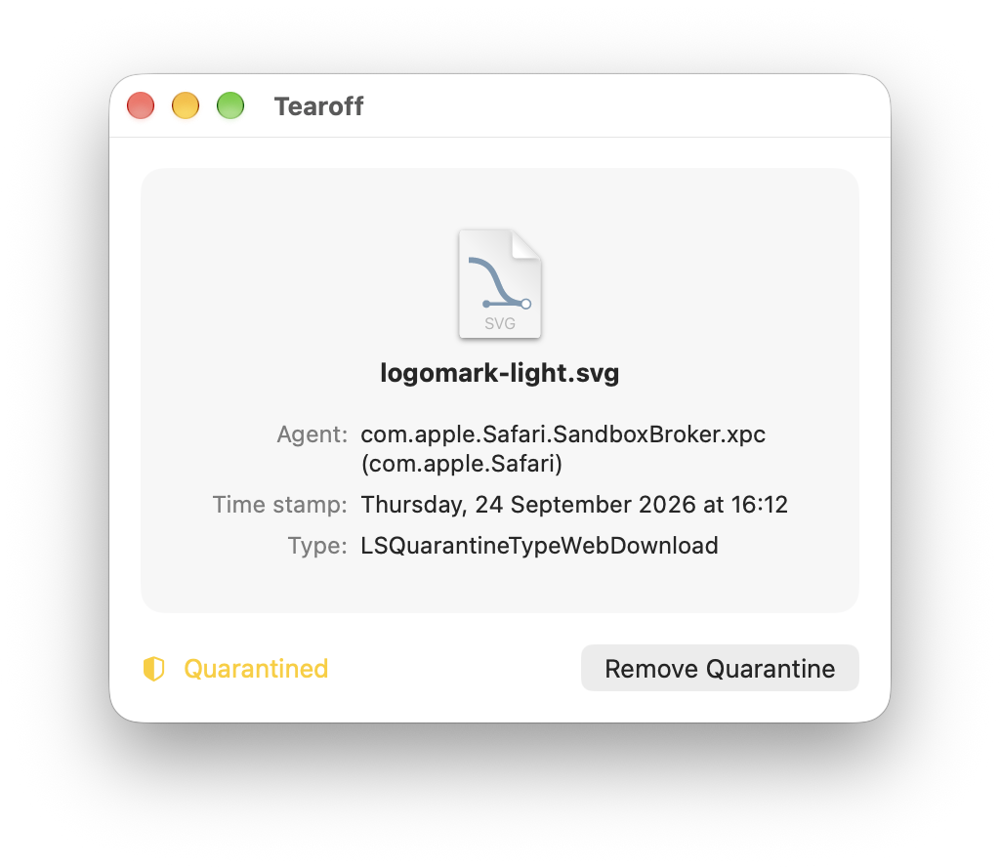

# Tearoff

A small macOS utility to inspect and remove the quarantine attribute from items.

[Download the latest release](https://github.com/superpixel/Tearoff/releases/latest)

## What it does

macOS marks items that come from outside the device (web downloads, AirDrop, Messages, and so on) with a quarantine attribute. Gatekeeper uses it to show the "downloaded from the Internet" prompt the first time you open the item.

Tearoff shows you:

- **Agent**: the app that downloaded the item, e.g. `Safari (com.apple.Safari)`
- **Time stamp**: when it was downloaded
- **Type**: how it arrived, e.g. `LSQuarantineTypeWebDownload`

It can also remove the quarantine attribute with one click.

## Usage

1. Drop an item onto the window, or use **File → Choose item…** (⌘O).
2. Check the quarantine information.
3. Click **Remove Quarantine** if you trust the item.

Press ⌘⌫ to clear the current item. Press ⌘? to open the help.

## Security note

Quarantine is a macOS security feature. Removing it skips the Gatekeeper first-launch check for that item. Only remove quarantine from items you trust and got from a source you trust.

## Requirements

- macOS 26 or later

## Building from source

1. Clone the repository.
2. Open `Tearoff.xcodeproj` in Xcode 26 or later.
3. Choose your own development team under *Signing & Capabilities*.
4. Build and run.

Tearoff isn’t sandboxed, because it needs to change extended attributes on any item you pick. It uses the hardened runtime and makes no network connections.

## How it works

Tearoff reads and writes the `quarantineProperties` URL resource key. To remove the attribute, it sets the key to `NSNull`. After removing it, Tearoff reads the attribute again to confirm it’s actually gone.

## License

Released under the [MIT License](LICENSE), with the exception of the Tearoff icon and artwork, which are trademarks of Nico Rohrbach / Superpixel and are not covered by this license. See
[BRANDING.md](BRANDING.md) for details.
